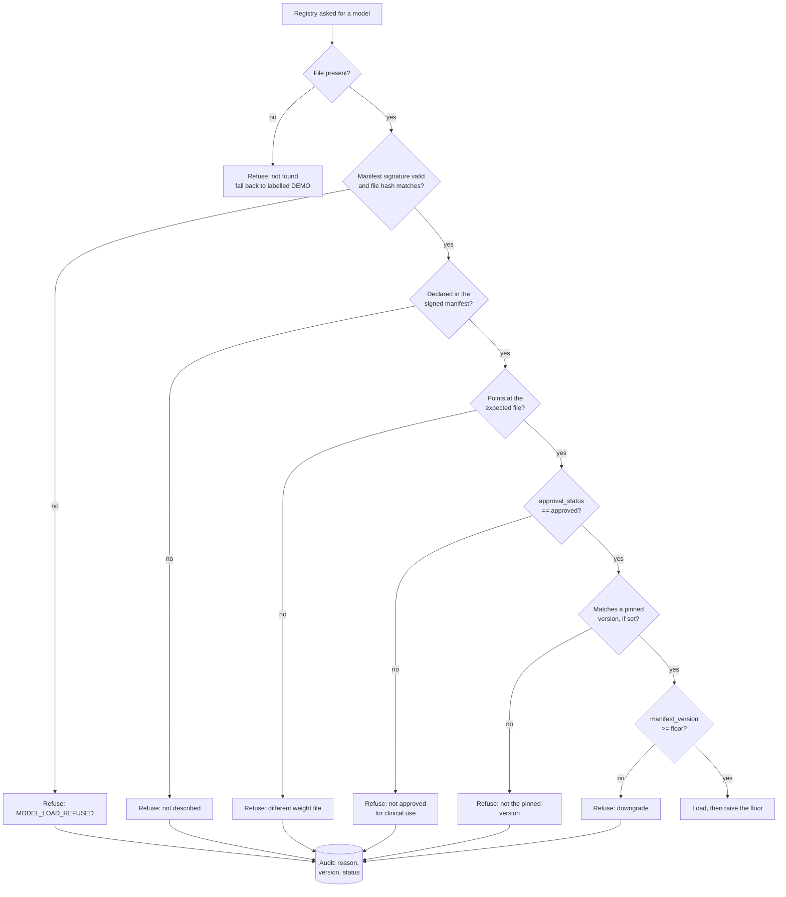

# PerioVision AI: Model and Inference Security

Two questions, answered by two different mechanisms. Conflating them was a real
vulnerability in this codebase, reproduced before it was fixed.

> **Integrity** — is this file unaltered since it was signed? Answered by RSA-PSS.
> **Authorisation** — is this the model we are approved to run? Answered by the provenance gate.

A valid signature answers only the first.

---

## 1. Load path



Every refusal falls back to clearly labelled DEMO behaviour. Nothing is ever loaded "with a
warning".

## 2. Three vulnerabilities, reproduced then closed

Each was demonstrated against the original implementation before any code changed.

**Rollback.** An archived bundle — old weight file, its own manifest, its own valid
signature — restored wholesale. Every integrity check passed and the withdrawn model
loaded. Signature validity says nothing about freshness.
*Closed by:* a monotonic `manifest_version` and a floor recorded in **writable storage,
outside the read-only weights mount**. Restoring an old bundle cannot also restore a floor
low enough to accept it. A corrupt floor raises rather than reading as zero, which would
silently re-open the hole.

**No approval.** The manifest held `{sha256, size}` and nothing else. A model signed for
evaluation was indistinguishable from one cleared for clinical use.
*Closed by:* `approval_status` inside the signed body, **and** a countersignature under a
separate key (below).

**Self-approval.** With one key, whoever could sign a model could also mark it approved, so
`approved_by` recorded who built it rather than who cleared it.
*Closed by:* a second keypair. `weights/approvals.json` is signed by `model_approval.pem`,
held by the approver; the manifest is signed by `model_signing.pem`, held by the builder.
Neither key is sufficient alone: the build key ships bytes it cannot clear, and the approval
key clears a hash it cannot produce.

**No identity binding.** A model name resolved by filename alone, so a different model
written to the expected name verified as the tooth detector.
*Closed by:* the manifest binds model name → file → hash, and the registry checks the file
matches what the deployment expects.

## 3. Provenance recorded

Per model, inside the signed manifest: `file`, `model_version`, `approval_status`,
`approved_by`, `approved_at`, `training_commit`, `dataset_version`, `framework`.

Because provenance sits inside the signed body, promoting a model from `pending` to
`approved` by editing the manifest requires forging RSA-PSS. Four tamper variants are tested
and all are rejected at the signature.

And editing it successfully still achieves nothing: the manifest only *declares* intent. The
authority is `weights/approvals.json`, countersigned under the approval key and naming the
model's **exact SHA-256**. A rebuild - even at the same version number - changes the hash and
voids the clearance. That is intended, not an inconvenience.

```
builder:   scripts/sign_model.py      MODEL_SIGNING_PASSWORD   -> manifest.json(.sig)
approver:  scripts/approve_model.py   MODEL_APPROVAL_PASSWORD  -> approvals.json(.sig)
registry:  requires both, and the hash in the approval must match the file on disk
```

`config/model_approvals.json` ships with **both models `pending`**, so the gate fails closed:
a deployment that re-signs without editing it loads nothing and is told exactly why.

## 4. Inference-time controls

| Control | What it does | Honest limit |
|---|---|---|
| Upload guard | Rejects disguised files, bombs, oversized images before decode | — |
| Quality gate | Rejects radiographs too poor to measure | — |
| Adversarial screening | Noise residual and high-frequency share; flags perturbation | **A heuristic tuned on 30 real radiographs. Not a robustness guarantee.** |
| OOD detection | Flags inputs unlike the training distribution | Heuristic |
| Conformal prediction | Calibrated intervals instead of a bare number | Needs calibration data; uncalibrated state is reported |
| Review router | Forces clinician review on any flag | — |

**No adversarial-robustness claim is made.** The screening raises a flag that sends a case
to a human; it has not been evaluated against an adaptive attacker, and the module's own
docstring says so.

## 5. Clinical safety

The system is decision **support**. It does not diagnose.

- Only a dentist can sign off an analysis — not an admin, not a technician.
- Low confidence, adversarial flags, OOD flags and demo mode all force review.
- Uncertainty is shown, not hidden behind a single number.
- Thresholds live in `config/thresholds.json` and are never changed to improve a metric.
- Every prediction, review and report is audited against a pseudonymous patient ID.

## 6. Known limitations

- **Approval is an attestation, not validation.** The approver asserts clinical fitness;
  nothing verifies they actually evaluated the model. What is enforced is *who* may assert
  it, and that the assertion covers exact bytes.
- **Two keys in one pair of hands defeats the separation**, as it would any separation of
  duties. Keep `MODEL_SIGNING_PASSWORD` and `MODEL_APPROVAL_PASSWORD` apart, and in a real
  deployment keep the private keys on different machines.
- **Provenance fields are unverified strings.** `training_commit` is not checked against a
  real commit, and `dataset_version` not against a real dataset hash.
- **The floor is writable by the application.** A compromised process could lower it; weights
  are read-only, so both would have to be subverted. `MODEL_EXPECTED_VERSIONS` pins exact
  versions from outside the container where that matters.
- **First deployment has floor 0.** Any version is accepted once, then it ratchets.
- **Model extraction is not addressed.** Rate limits slow bulk querying; nothing detects it.
