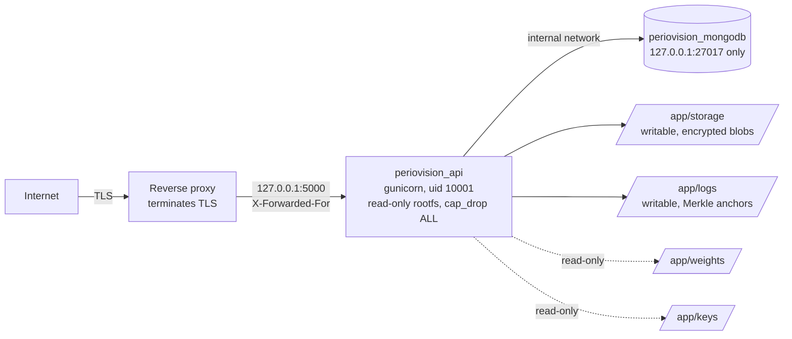

# PerioVision AI: Deployment and Supply-Chain Security

---

## 1. Runtime topology



Neither container is published beyond loopback. TLS terminates at the proxy, which is why
`TRUSTED_PROXY_COUNT=1` is set — without it every client shares one rate-limit bucket and
audit records log the proxy instead of the caller.

## 2. Container hardening

| Setting | Why |
|---|---|
| `gunicorn`, not `python wsgi.py` | The image previously ran the Werkzeug development server, which its own documentation says is unsuitable for production |
| `USER appuser` (uid 10001) | It previously ran as root |
| Multi-stage build | The compiler and build tools never reach the runtime image |
| `read_only: true` + noexec tmpfs | A compromised process cannot rewrite its own code; scratch space cannot be executed |
| `cap_drop: ALL` | No Linux capabilities at all |
| `no-new-privileges: true` | setuid binaries cannot escalate |
| Memory limits (4 GB API, 1 GB Mongo) | One container cannot starve the host |
| `weights` and `keys` mounted `:ro` | The application must never rewrite its own trust anchors |
| Exec-form CMD | gunicorn is PID 1 and receives SIGTERM directly, so shutdown is clean |
| Base images pinned by digest | A rebuild cannot silently pick up different content behind the same tag |
| `HEALTHCHECK` | Orchestrators can tell live from listening |

## 3. Secrets at deploy time

Every secret comes from the root `.env`, which is gitignored. `docker-compose.yml` uses
`${VAR:?message}` for the database credentials, so compose **refuses to start** rather than
defaulting — verified: validation fails with a named error when they are absent.

No secret is baked into any image layer. `.env.example` contains placeholders only, and
`backend/keys/*` is gitignored except the public key and README.

## 4. Supply chain

**Actions pinned to commit SHAs.** All nine, each verified to exist against the GitHub API
rather than typed from memory. A tag is a mutable pointer: whoever controls an action
repository can move `v4` to new code that then runs with this repository's token.
`gitleaks-action` is third-party and reads the full git history, which makes it the one that
matters most.

**Base images pinned by digest** — `python:3.11-slim` and `mongo:7.0`, both resolved and
verified.

**Dependencies pinned exactly** in `requirements.txt`, with `package-lock.json` for the
frontend. Dependabot covers pip, npm, github-actions and docker, grouped per ecosystem.

**SBOM per build** — CycloneDX for both halves, retained 90 days. Verified locally at 26
backend components, all carrying purls, so a scanner can consume them.

**Scanning** — pip-audit and npm audit on declared dependencies; Trivy on the built image,
failing on HIGH/CRITICAL **that have a fix available**. An unfixed CVE cannot be acted on by
upgrading and would only teach people to ignore a red build, so it goes to the Security tab
via SARIF instead.

## 5. Deploying

```bash
cp .env.example .env          # then fill in real values
openssl rand -hex 32          # for each of JWT_SECRET_KEY, FIELD_ENCRYPTION_KEY, AUDIT_ANCHOR_KEY

cd backend
python scripts/sign_model.py --init-keys                  # once
# edit config/model_approvals.json: set versions and approval_status
python scripts/sign_model.py                              # sign weights + approvals

cd .. && docker compose up -d --build
```

Checks before going live:

- `DB_MODE=production` — demo mode uses an in-memory database and throwaway keys
- `TRUSTED_PROXY_COUNT` matches the real number of proxy hops
- `CORS_ORIGINS` lists only real frontend origins
- `REDIS_URL` set if running more than one worker, or rate limits are per-process
- `MODEL_EXPECTED_VERSIONS` set if exact model versions must be pinned
- TLS terminates at the proxy; the container speaks HTTP on loopback only

## 6. Limitations

- **The CI security jobs have never run.** Trivy and the SBOM steps are syntactically valid
  with verified pins, but the first run on GitHub is their real test.
- **No branch protection or required review.** A repository setting, not a file that can be
  committed. Until it is enabled, SHA-pinned actions protect the supply chain while nothing
  protects `main` itself.
- **No signed container images.** Cosign or similar would let a deployment verify what it
  pulls.
- **No runtime security monitoring.** Nothing watches the container once it starts.
- **MongoDB has no TLS inside the compose network.** Traffic stays on an internal bridge;
  `enforce_mongo_tls` requires TLS for any non-local URI.
- **Backups are not covered** by anything here.
