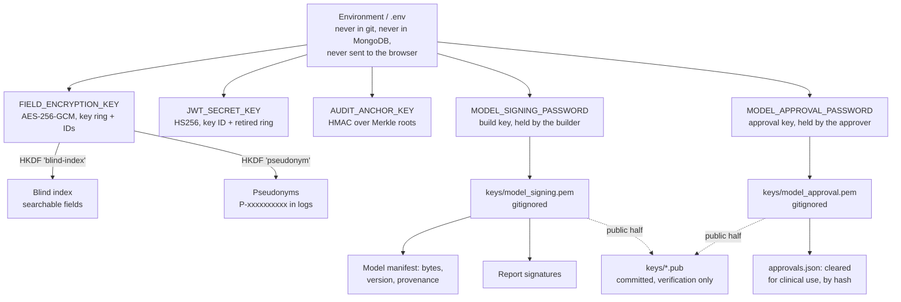

# PerioVision AI: Key Management

Seven cryptographic purposes, seven separate keys. No key does two jobs.

---

## 1. Hierarchy

**Why HKDF rather than reuse.** The blind index is an HMAC over a patient name; the
encryption key encrypts it. Using one key for both would mean a single compromise breaks
confidentiality and searchability together, and that an HMAC oracle becomes an oracle on the
encryption key. HKDF with distinct `info` strings makes them independent.

## 2. Per-key detail

| Purpose | Key | Algorithm | Rotation |
|---|---|---|---|
| PHI fields and blobs | `FIELD_ENCRYPTION_KEY` / `FIELD_ENCRYPTION_KEYS` | AES-256-GCM | Key IDs in every ciphertext; old keys stay for decryption. `scripts/rotate_keys.py` |
| Searchable index | HKDF `blind-index` | HMAC-SHA256 | Rotates with the field key; indexes must be rebuilt |
| Log pseudonyms | HKDF `pseudonym` | HMAC-SHA256 | Rotating changes every pseudonym; treat as stable |
| Access and refresh tokens | `JWT_SECRET_KEY` | HMAC-SHA256 | `kid` header + `JWT_SECRET_KEY_RETIRED`, so rotation does not end live sessions |
| Audit anchors | `AUDIT_ANCHOR_KEY` | HMAC-SHA256 | Rotating invalidates older anchors; keep the old key to verify history |
| Model manifests (build) | `MODEL_SIGNING_PASSWORD` | RSA-PSS SHA-256 | New keypair + re-sign; the public half is committed |
| Clinical approval | `MODEL_APPROVAL_PASSWORD` | RSA-PSS SHA-256 | New keypair + re-approve. Must be a different secret from the build key, ideally on a different machine |
| Report signatures | same RSA key | RSA-PSS SHA-256 | Rotating means older reports verify against the retired public key |

## 3. Rules the code enforces

- **No key in source.** Outside demo mode, a missing `JWT_SECRET_KEY`, `FIELD_ENCRYPTION_KEY`
  or `AUDIT_ANCHOR_KEY` raises at startup rather than falling back to a default.
- **Minimum lengths.** JWT secrets under 32 characters are refused; field keys must be
  exactly 32 bytes.
- **Demo mode is loud.** It generates throwaway keys and logs a warning for each.
- **Keys never reach the browser.** The frontend holds an access token in memory only.
- **Keys never enter MongoDB.** Only ciphertext and key IDs are stored.
- **Keys are never logged.** Audit entries carry key IDs, never key material; a test asserts
  the signing password appears in no audit record.
- **Private keys are gitignored.** `backend/keys/*` is excluded except `*.pub` and the README.
- **The container mounts keys read-only**, so a compromised process cannot rewrite them.

## 4. Rotation

**Field encryption** — add the new key with a new ID, mark it active, keep the old one for
decryption, re-encrypt with `scripts/rotate_keys.py`, then retire the old key once nothing
references it. Every ciphertext records the ID that produced it, so old and new coexist.

**JWT** — set `JWT_SECRET_KEY` to the new value, set `JWT_ACTIVE_KID` to a new ID, and move
the old one to `JWT_SECRET_KEY_RETIRED` as `kid:secret`. Tokens signed before the rotation
keep verifying until they expire. Without this, rotating logged every user out at once.

**Model signing** — generate a new keypair, re-sign the manifest, commit the new public key.
Reports signed with the old key need the old public key to verify, so retire deliberately.

## 5. A real incident, and what it changed

While verifying the event taxonomy, an ad-hoc command imported a test module outside pytest.
That loaded `app.config` before the test environment was applied, so `KEYS_DIR` resolved to
the real `backend/keys/`, and the test fixture's `generate_keypair()` wrote a throwaway
3072-bit key over the project's committed 4096-bit public key.

Caught, the key restored from git, the commit amended. The private half was gitignored and
never left the machine, and nothing had been signed with the throwaway, so no artifact
needed re-signing.

`conftest.py` now passes `keys_dir` explicitly instead of relying on import order, and the
exact command that caused it was re-run to confirm it no longer can. **The lesson stands:
test fixtures that generate keys must name their directory, never inherit it.**

## 6. Limitations

- **No KMS or HSM.** Keys are environment variables. Adequate for a single deployment;
  a managed KMS would be the next step, and `security/secrets.py` already supports AWS
  Secrets Manager behind `USE_AWS_SECRETS`.
- **The build key still signs both manifests and reports.** Separating those would let a
  report signer exist who cannot ship models.
- **Nothing stops one person holding both the build and approval keys.** The split is
  enforced cryptographically but assigned organisationally.
- **No key-usage audit.** Encryption and signing are not individually logged — only their
  outcomes are.
- **No automated rotation schedule.** Rotation is manual and nothing reminds anyone.
