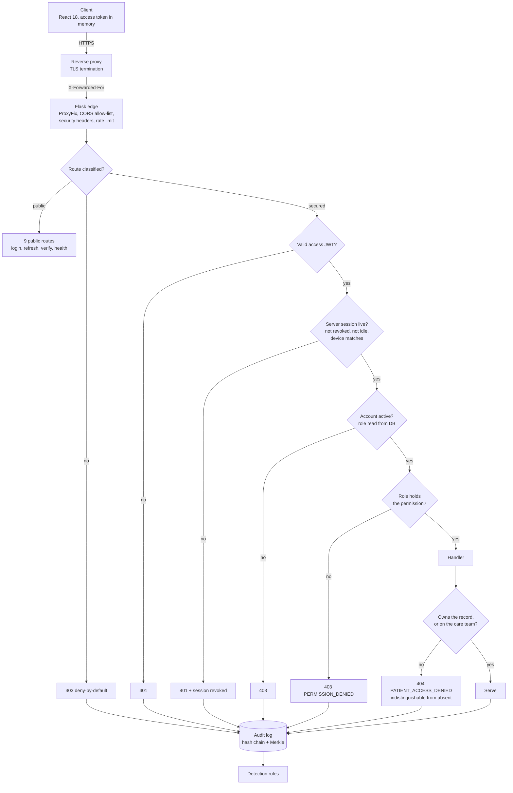

# PerioVision AI: Security Architecture

Every control described here exists in the codebase and is covered by a test. Nothing
is aspirational. Where something is a limitation rather than a control, it says so.

Counts in this document are read from the running application, not maintained by hand:
53 routes, 9 of them deliberately public and **0 unclassified**; 4 roles over 20
permissions; 48 classified audit events feeding 12 detection rules; 12 classified data
stores; 21 Security Lab scenarios asserting 104 facts; 212 automated tests.

---

## 1. The request path

Every protected request crosses the same gates in the same order. The ordering matters:
identity before policy, policy before data, and the object-level check last, because it
is the only one that needs the record in hand.

**Deny by default is structural, not a convention.** `enforce_deny_by_default` runs before
every request and refuses any route that carries neither `@secured(...)` nor `@public`.
A forgotten decorator fails closed instead of open, which is why "0 unclassified" above is
a property of the system rather than a review finding.

**Out-of-scope records answer 404, not 403.** A 403 would confirm the record exists, which
turns any patient endpoint into an enumeration oracle. The body is byte-identical to a
genuine miss.

**The role in the JWT is a hint.** The Zero Trust guard re-reads it from the database on
every request, so demoting or disabling an account takes effect immediately rather than
when the token expires. One test exists solely to prove this, and it is the only test that
fails if the guard is changed to trust the token.

---

## 2. Layers

```mermaid
flowchart LR
    subgraph Edge
        L1[TLS + proxy]
        L2[Headers, CORS,<br/>rate limit, schemas]
    end
    subgraph Identity
        L3[bcrypt + lockout]
        L4[JWT: aud, kid,<br/>15 min]
        L5[TOTP MFA]
        L6[Server sessions,<br/>refresh rotation]
    end
    subgraph Policy
        L7[RBAC: 4 roles,<br/>20 permissions]
        L8[Object-level<br/>patient scope]
        L9[Zero Trust guard]
    end
    subgraph Data
        L10[AES-256-GCM<br/>fields + blobs]
        L11[HKDF key<br/>separation]
        L12[Classification<br/>+ retention]
    end
    subgraph Model
        L13[RSA-PSS<br/>signed manifest]
        L14[Provenance +<br/>approval gate]
        L15[Adversarial / OOD<br/>to clinician review]
    end
    subgraph Assurance
        L16[Hash-chained audit<br/>+ Merkle anchors]
        L17[Event taxonomy<br/>+ 12 rules]
        L18[Security Lab<br/>21 scenarios]
        L19[CI: CVEs, secrets,<br/>SAST, container, SBOM]
    end
    Edge --> Identity --> Policy --> Data
    Policy --> Model
    Data --> Assurance
    Model --> Assurance
```

---

## 3. Trust boundaries

| # | Boundary | What enforces it |
|---|---|---|
| TB1 | Internet → proxy | TLS; `TRUSTED_PROXY_COUNT` so the real client IP drives rate limiting and audit |
| TB2 | Proxy → application | Every route classified; 9 deliberately public |
| TB3 | Anonymous → authenticated | JWT + server-side session + device fingerprint |
| TB4 | Authenticated → role | RBAC permission matrix |
| TB5 | Role → patient record | `load_patient_or_404` — the strongest practical boundary |
| TB6 | Application → plaintext PHI | AES-256-GCM; keys in the environment, never in MongoDB |
| TB7 | Application → model weights | RSA-PSS manifest + approval gate; weights mounted read-only |
| TB8 | Application → audit trail | Append-only chain; Merkle anchors written outside the database |
| TB9 | Container → host | Non-root, `cap_drop: ALL`, read-only root filesystem |
| TB10 | Repository → CI | SHA-pinned actions; **no branch protection** (see limitations) |

TB5 is centralised in one function. Analyses, image layers, reports and review sign-off
all reach it through `load_analysis_or_404`, so they inherit patient scope rather than each
re-implementing it.

---

## 4. Two places the architecture refuses to do the obvious thing

**The audit log is never purged.** It is a hash chain: entry N commits to N-1. Deleting an
old entry does not reclaim space, it breaks verification for everything after it and makes
the trail look tampered with. A conventional "delete records older than N days" sweep
applied across every collection would destroy the one control that proves nothing else was
destroyed. `retention.PROTECTED` names those stores and `assert_purgeable` refuses them,
along with clinical stores and any store nobody has classified.

**A valid signature is not permission to load a model.** An archived weight file kept with
its own manifest and signature verifies perfectly — that was reproduced against the
original implementation before the gate was built. Integrity answers "unaltered since
signing"; it cannot answer "is this the model we approved". The approval gate answers the
second question, and the Security Lab demonstrates both halves.

---

## 5. Known limitations

These are real and currently unaddressed.

- **Detection is pull, not push.** Alerts appear when the security centre is opened. Nobody
  is paged. Routing to a SIEM or on-call is a deployment concern.
- **Model approval is an attestation.** The approver asserts clinical fitness under a key
  the builder does not hold, so the two roles are separated and the clearance covers exact
  bytes. Nothing verifies the approver actually evaluated the model, and holding both keys
  defeats the split.
- **Device binding is a User-Agent hash.** Spoofable, and it logs users out when their
  browser updates.
- **Authorization failures are detected, not throttled.** A burst raises an alert; nothing
  blocks the account. Deliberate — detection is kept separate from enforcement.
- **Detection thresholds are unvalidated.** Chosen by reasoning, not from real traffic.
- **No branch protection or required review.** A repository setting, not a file.
- **Controls are aligned with HIPAA safeguards and the OWASP Top 10. Nothing here is
  certified, and the system has had no external assessment.**

---

## 6. Where to look

| Topic | Document |
|---|---|
| Threats, actors, residual risk | [THREAT_MODEL.md](THREAT_MODEL.md) |
| Control → threat → test matrix | [SECURITY_CONTROLS.md](SECURITY_CONTROLS.md) |
| Model integrity and approval | [AI_SECURITY.md](AI_SECURITY.md) |
| Routes, schemas, error handling | [API_SECURITY.md](API_SECURITY.md) |
| Classification and retention | [DATA_SECURITY.md](DATA_SECURITY.md) |
| Key hierarchy and rotation | [KEY_MANAGEMENT.md](KEY_MANAGEMENT.md) |
| What to do when something happens | [INCIDENT_RESPONSE.md](INCIDENT_RESPONSE.md) |
| How any of this is proven | [SECURITY_TESTING.md](SECURITY_TESTING.md) |
| Container and CI hardening | [DEPLOYMENT_SECURITY.md](DEPLOYMENT_SECURITY.md) |
| Original design notes | [SECURITY.md](SECURITY.md) |
